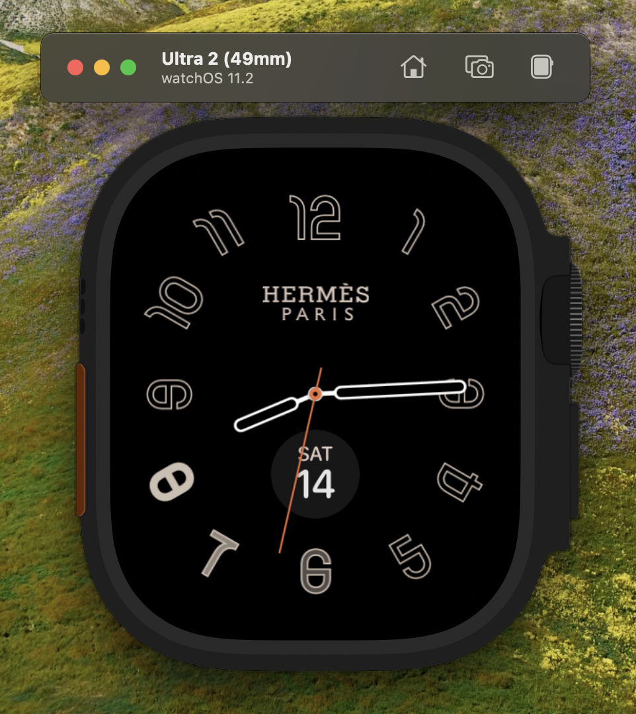
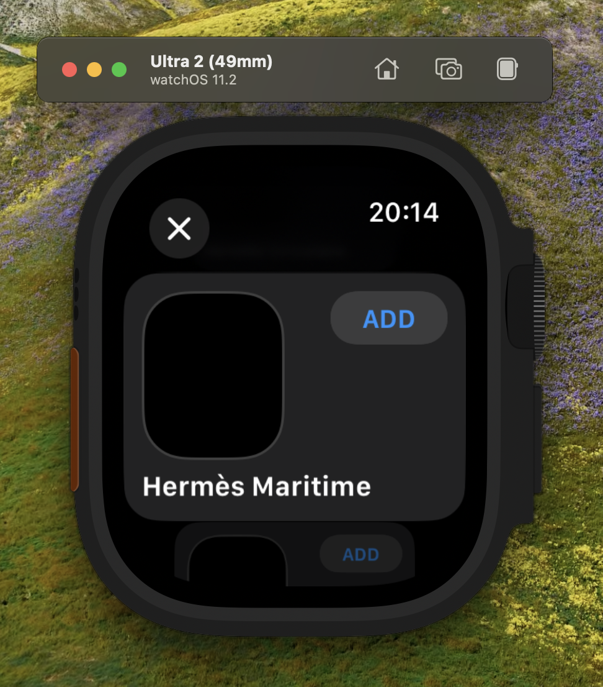
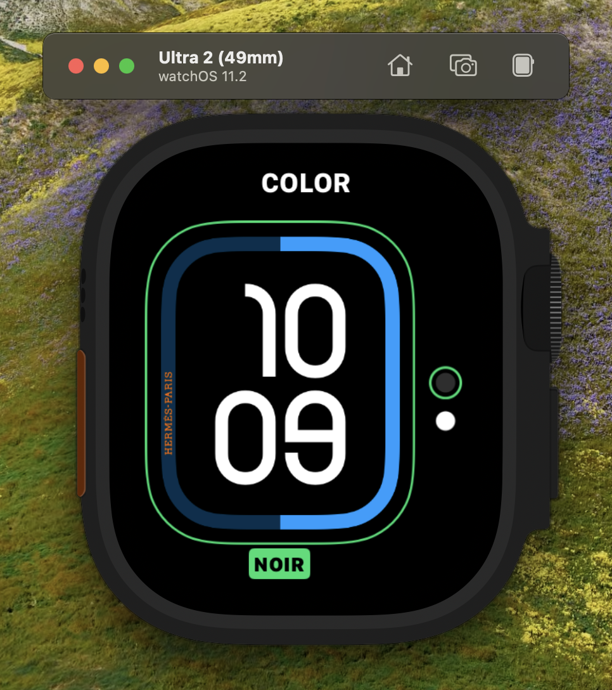

# HermesEnabler

Enable Hermès Watch Faces on any Apple Watch devices

```
% lldb -n ClockFace -w
(lldb) breakpoint set -n UIApplicationMain
(lldb) po dlopen("/Users/pookjw/Library/Developer/Xcode/DerivedData/HermesEnabler-dfkwcunscxnwntalhyrcytnzxdgh/Build/Products/Debug-watchsimulator/HermesEnabler.framework/HermesEnabler", 0x5)
```






